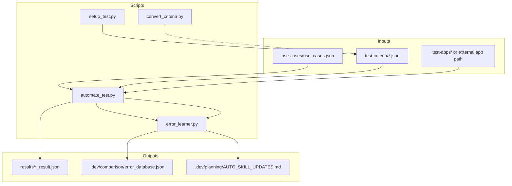
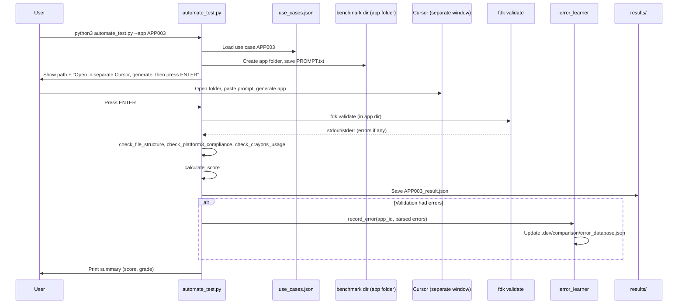
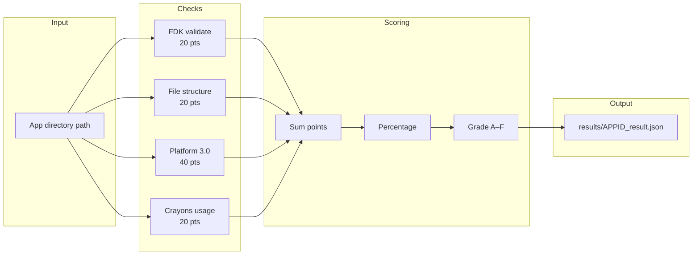
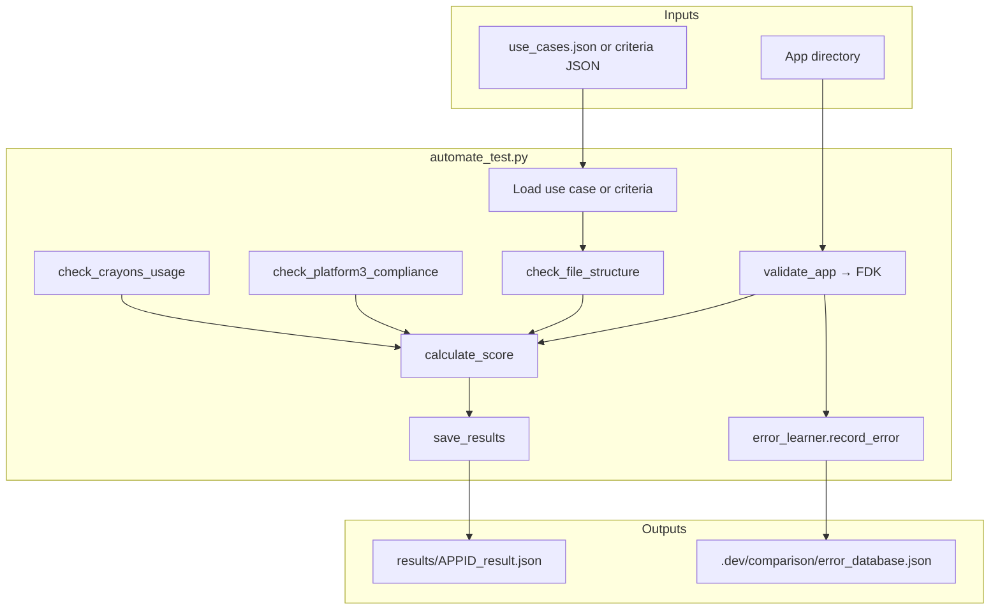

# Freshworks Platform 3.0 Benchmarking Suite — Architecture & Flow

This document describes how the benchmarking project works and the main flows, with Mermaid diagrams for quick reference.

---

## 1. What This Project Does

The **Benchmarking Suite** is an automated testing and validation system for **Freshworks Platform 3.0 marketplace apps**. It:

- **Validates** apps with FDK and custom checks (Platform 3.0, Crayons UI, file structure).
- **Scores** apps on a 100-point scale with letter grades (A–F).
- **Learns** from FDK validation failures and suggests skill/rule updates to avoid repeating the same mistakes.

It supports two main modes:

1. **Generate & Test** — Use a predefined use case, generate an app (e.g. in Cursor), then run validation and scoring.
2. **Evaluate** — Point at an existing app directory and run validation/scoring without regeneration (optionally with custom requirements from a criteria file or comma-separated list).

---

## 2. High-Level Architecture



**Components:**

| Component | Role |
|-----------|------|
| **use-cases/use_cases.json** | Defines app prompts, type (Frontend/Serverless), product, and expected files for “Generate & Test” mode. |
| **test-criteria/** | Per-app criteria (requirements, expected_files, description). Used by `--evaluate` with `--requirements <file>`. |
| **setup_test.py** | Interactive or file-based setup: creates criteria JSON and `test-apps/<app_id>/` directory. |
| **convert_criteria.py** | Converts plain-text requirements into criteria JSON (standalone helper). |
| **automate_test.py** | Main entry: runs “Generate & Test” or “Evaluate”, runs FDK + compliance checks, scores, saves results, and triggers error learning. |
| **error_learner.py** | Parses FDK output, records errors, identifies patterns, and can generate `.dev/planning/AUTO_SKILL_UPDATES.md`. |
| **results/** | One JSON file per run (`<app_id>_result.json`) with validation, compliance, score, and optional requirements_met. |
| **.dev/comparison/error_database.json** | Persisted error records and pattern counts for learning. |
| **.dev/planning/AUTO_SKILL_UPDATES.md** | Generated suggestions for rule/skill updates based on recurring error patterns. |

---

## 3. Flow 1: Generate & Test (New App from Use Case)

This flow is used when you want to generate a new app from a predefined use case and then validate and score it.



**Steps in short:**

1. Run `automate_test.py --app <APP_ID>`.
2. Script loads use case from `use-cases/use_cases.json`, creates app folder under benchmark dir, writes `PROMPT.txt`.
3. You open that folder in another Cursor window, generate the app from the prompt, then come back and press ENTER.
4. Script runs `fdk validate`, then file structure, Platform 3.0 compliance, and Crayons checks, computes score, and writes `results/<APP_ID>_result.json`.
5. If FDK reported errors, the error learner records them and updates the error database.

---

## 4. Flow 2: Evaluate Existing App (Quick Setup)

This flow uses `setup_test.py` to define criteria and prepare an app directory, then `automate_test.py --evaluate` to run validation and scoring.

```mermaid
flowchart LR
    subgraph setup["Setup Phase"]
        A[Run setup_test.py APP001]
        B[Paste criteria: JSON or plain text]
        C[Save test-criteria/APP001-criteria.json]
        D[Create test-apps/APP001/]
    end

    subgraph prep["Preparation"]
        E[Copy app into test-apps/APP001/]
    end

    subgraph eval["Evaluation Phase"]
        F[automate_test.py --evaluate test-apps/APP001]
        G[--app-id APP001]
        H[--requirements test-criteria/APP001-criteria.json]
    end

    subgraph run["Run"]
        I[FDK validate + compliance + Crayons]
        J[Score + results/APP001_result.json]
        K[Error learning if errors]
    end

    A --> B --> C
    C --> D
    D --> E
    E --> F
    F --> G --> H
    H --> I --> J --> K
```



**Steps in short:**

1. Run `setup_test.py APP001` (optionally `--criteria-file` or `--app-path`).
2. Paste criteria (JSON or plain text); script saves `test-criteria/APP001-criteria.json` and creates `test-apps/APP001/`.
3. Copy your app into `test-apps/APP001/` (or use `--app-path` during setup).
4. Run:  
   `automate_test.py --evaluate test-apps/APP001 --app-id APP001 --requirements test-criteria/APP001-criteria.json`
5. Same validation and scoring as in Flow 1; requirements from the criteria file are reflected in the result (e.g. `requirements_met`).

---

## 5. Flow 3: Evaluate Existing App (Direct, No Setup Script)

When you already have an app on disk and don’t need the interactive setup, you run evaluate directly.

```mermaid
flowchart TB
    A[App on filesystem] --> B[Copy to test-apps/my-app/ or use any path]
    B --> C[python3 automate_test.py --evaluate PATH]
    C --> D{Options}
    D --> E[--app-id ID]
    D --> F[--requirements "R1,R2" or path to criteria JSON]
    E --> G[Resolve expected files]
    F --> G
    G --> H[FDK validate]
    H --> I[File structure check]
    I --> J[Platform 3.0 compliance]
    J --> K[Crayons usage]
    K --> L[Calculate score]
    L --> M[Save results/ID_result.json]
    M --> N{Errors?}
    N -->|Yes| O[error_learner.record_error]
    N -->|No| P[Done]
    O --> P
```

**Expected files** are chosen in this order:

1. If `--requirements` points to a criteria JSON with `expected_files`, use that.
2. Else if `--app-id` matches a use case in `use_cases.json`, use that use case’s `expected_files`.
3. Else auto-detect from app layout (e.g. `manifest.json`, `app/`, `server/`, `config/`).

---

## 6. Validation & Scoring Pipeline

Regardless of mode (Generate & Test or Evaluate), the same validation and scoring pipeline runs.



**What each check does:**

| Check | Points | Description |
|-------|--------|-------------|
| **FDK validation** | 20 | `fdk validate` in app directory; pass/fail. |
| **File structure** | 20 | Proportional to how many of the expected files exist (from use case or criteria). |
| **Platform 3.0** | 40 | 5 × 8 pts: platform-version 3.0, `modules` structure, no whitelisted-domains, `engines` present, correct location placement (or serverless/background-only). |
| **Crayons usage** | 20 | CDN (10), fw-button (5), no plain HTML buttons (5). |

**Grade:** A 90–100, B 80–89, C 70–79, D 60–69, F &lt; 60.

---

## 7. Error Learning Flow

Error learning runs only when FDK validation reports errors (platform or lint). It does not run for “warnings only” or when validation passes.

```mermaid
flowchart TB
    subgraph capture["Capture"]
        A[FDK validate returns errors]
        B[automate_test parses stdout/stderr]
        C[error_learner.parse_fdk_output]
        D[error_learner.record_error]
    end

    subgraph store["Store"]
        E[.dev/comparison/error_database.json]
        F[errors[] + patterns{}]
    end

    subgraph analyze["Analyze"]
        G[--show-stats]
        H[--generate-skill-updates]
        I[identify_new_patterns: count >= 2, not fixed]
        J[create_skill_update_document]
    end

    subgraph output["Output"]
        K[.dev/planning/AUTO_SKILL_UPDATES.md]
    end

    A --> B --> C --> D
    D --> E
    E --> F
    F --> G
    F --> H --> I --> J
    J --> K
```

**Flow in words:**

1. **Record:** When `validate_app()` sees platform or lint errors, it calls `ErrorLearner.record_error(app_id, parse_fdk_output(stdout+stderr))`. Each error is categorized into a **pattern** (e.g. `deprecated_request_api`, `request_schema_error`, `async_no_await`).
2. **Store:** Records and pattern counts are persisted in `.dev/comparison/error_database.json`.
3. **Stats:** `automate_test.py --show-stats` (or `error_learner.py stats`) reads that file and prints counts and most common patterns.
4. **Suggestions:** `automate_test.py --generate-skill-updates` (or `error_learner.py suggest`) finds patterns with count ≥ 2 and not marked fixed, then writes `.dev/planning/AUTO_SKILL_UPDATES.md` with suggested rule/skill text and checklist items.

---

## 8. Data Flow Summary (Single Run)



---

## 9. File Layout Reference

```
benchmarking/
├── automate_test.py          # Main script: --app, --evaluate, --show-stats, --generate-skill-updates
├── setup_test.py             # Interactive/file setup → criteria + test-apps dir
├── convert_criteria.py       # Plain text → criteria JSON
├── error_learner.py          # Parse FDK errors, record patterns, generate AUTO_SKILL_UPDATES.md
├── example-criteria.json     # Example criteria shape
├── use-cases/
│   └── use_cases.json        # Use cases (id, name, app_type, product, prompt, expected_files)
├── test-criteria/           # Per-app criteria (e.g. APP001-criteria.json)
├── test-apps/                # App directories to evaluate
├── results/                  # *_result.json per run
└── .dev/
    ├── comparison/
    │   └── error_database.json
    └── planning/
        └── AUTO_SKILL_UPDATES.md
```

---

## 10. Quick Command Reference

| Goal | Command |
|------|--------|
| Generate & test from use case | `python3 automate_test.py --app APP003` |
| Setup criteria + dir | `python3 setup_test.py APP001` |
| Evaluate with criteria file | `python3 automate_test.py --evaluate test-apps/APP001 --app-id APP001 --requirements test-criteria/APP001-criteria.json` |
| Evaluate with inline requirements | `python3 automate_test.py --evaluate test-apps/my-app --requirements "OAuth,Webhooks"` |
| Error stats | `python3 automate_test.py --show-stats` |
| Generate skill update doc | `python3 automate_test.py --generate-skill-updates` |

---

*This document is generated from the benchmarking codebase and README. For full usage and troubleshooting, see the main [README.md](../README.md).*
